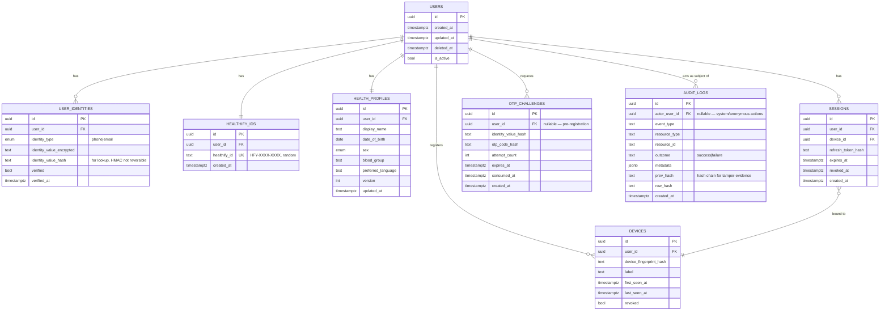

# Healthify — Database (Phase 1 schema)

Full target schema is the ~30 tables listed in the master spec (§68). We are creating only
the tables Phase 1 needs; later phases add tables via new Alembic migrations rather than
altering this design out from under itself.

## ER diagram — Phase 1

## Key decisions

- **PII vs. identity separation (§9):** `user_identities` stores phone/email *encrypted*
  plus a keyed-hash (HMAC) column for equality lookup — the plaintext is never queried
  directly, and no other table stores phone/email at all. `health_profiles` never contains
  a phone/email column.
- **Healthify ID (§11):** generated from a CSPRNG, checked for uniqueness against
  `healthify_ids.healthify_id`, format `HFY-XXXX-XXXX` using a Crockford-base32-style
  alphabet (excludes ambiguous characters). Never derived from the UUID or any PII.
- **OTP storage (§10):** only a hash of the OTP is ever stored (argon2), never the code
  itself. `attempt_count` + `expires_at` enforce brute-force limits at the DB level in
  addition to Redis-backed rate limiting on the endpoint.
- **Audit log immutability (§55):** `audit_logs` is append-only — the DB role the API uses
  has `INSERT`/`SELECT` only on this table, no `UPDATE`/`DELETE`. `row_hash` chains from
  `prev_hash` so tampering is detectable even by someone with raw DB access.
- **Soft delete:** `users.deleted_at` — account deletion (§92) marks rather than hard-deletes
  immediately, per the grace-period requirement; hard deletion/anonymization is a Phase-later
  job once retention policy (§128) is defined.

Later phases add `roles`/`permissions` (RBAC/ABAC, §49), `lab_reports`/`lab_results`/... (Phase
2), `sharing_sessions`/`consents`/`access_requests` (Phase 4), `doctor_profiles` (Phase 5),
etc. — each as its own migration, never a rewrite of this one.
